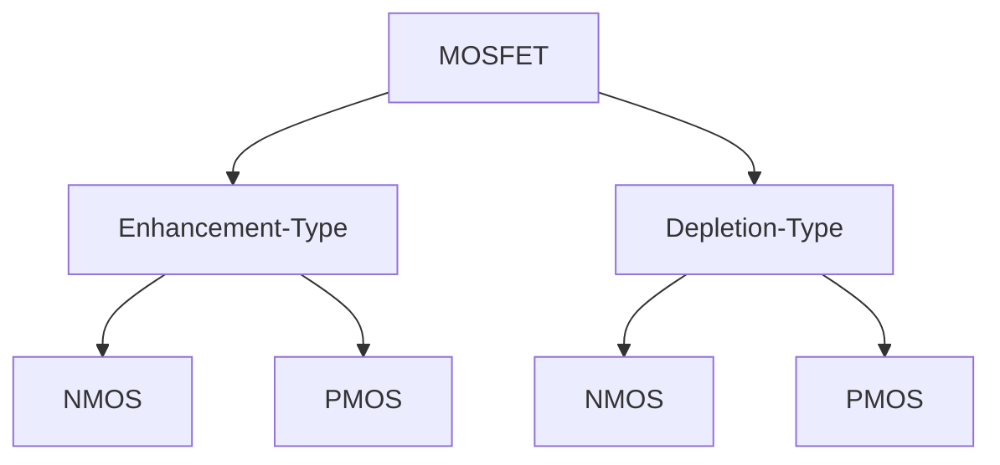

# MOSFETS
## Introduction
Now that we understand that we can manipulate the charge carriers in the semiconductor substrate with the help of a capacitor like structure, we can now make a transistor.
In very simple terms, a transistor is basically a controlled switch. In normal switches, human contact acts as the control and requires manual toggling for it to change state, but in transistors, we can design them to be turn on or off, with electrical conditions.
Our aim here is to create this electrically controlled switch using the powers of MOS Capacitor. If we inject donor impurity into two smaller regions in the bulk of the p substrate, that are spaced apart, we can use the gate control to create a channel for electrons to travel as and when needed. That in very rudimentary terms is what a MOSFET looks like and how it  works.

## Structure
The MOSFET structure looks something like what the below image is depicting:
![[Pasted image 20250220190503.png]]
The terminals of the doped regions we talked about in the introduction section are highlighted as olive green in the above image, and are referred to as the source and drain terminals.
## Classification 
MOSFETs can be classified into two categories:  
##### 1. Enhancement-Type MOSFETs  
- NMOS Enhancement FET  
- PMOS Enhancement FET  
##### 2. Depletion-Type MOSFETs  
- NMOS Depletion FET  
- PMOS Depletion FET  

- **Enhancement Mode** - needs voltage (greater than Vth) to create a channel and become conductive.
- **Depletion Mode** - At the time of fabrication, a channel is already created into them which can be closed off with the help of gate control.
- **NMOS** - if the substrate is p-type and the doped regions are n-type in nature, they are referred to as NMOS or N-type MOSFETs. The source terminal in the NMOS needs to be tied down to the lowest potential in the circuit for proper functioning.
- **PMOS**- if the substrate is n-type and the doped regions are p-type in nature, they are referred to as PMOS or P-type MOSFETs. The source terminal in the PMOS needs to be tied up to the highest potential in the circuit for proper functioning.
Note: The Threshold Voltage (Vth) is fixed for both and PMOS for a given technology.

## Regions of MOSFET Operation
Depending on the relative voltages of the source, drain, and gate, an NMOS transistor operates in one of the following regions:
- **Cutoff Region**: The MOSFET is OFF, and current flow is essentially zero. The gate voltage V_G  is below the threshold voltage  V_th, meaning no conductive channel forms between source and drain. The substrate remains in depletion, preventing charge carriers from facilitating conduction. 

- **Deep-Triode Region**: This occurs immediately after cutoff when the channel just begins to form but \( V_{DS} \) is still very small. Since the drain-source voltage is minimal, current increases almost linearly with \( V_{DS} \), behaving like a small resistor. This is essentially a **subset** of the triode region where the MOSFET operates in an ohmic manner with negligible non-linearity.

- **Triode (Linear) Region**: The MOSFET is ON and behaves as a **controllable resistor**. This occurs when \( V_G > V_{th} \) and \( V_{DS} < V_G - V_{th} \). In this region, both \( V_G \) and \( V_{DS} \) influence the drain current, and conduction increases as the channel resistance decreases. The MOSFET exhibits non-linearity at higher \( V_{DS} \), transitioning towards saturation. *(Note: This is not the "weak inversion" region—weak inversion occurs **below** \( V_{th} \), where subthreshold conduction happens.)*

- **Saturation (Active) Region**: The MOSFET enters saturation when \( V_{DS} \geq V_G - V_{th} \). Here, the channel pinches off at the drain side, and the current becomes **mostly independent of \( V_{DS} \)**, instead being controlled primarily by \( V_G \). This region is crucial for amplification in analog circuits. *(Note: Saturation does not mean "maximum current"—it means current stops depending on \( V_{DS} \) and is controlled by \( V_G \) alone.)*

- First group (Accumulation, Depletion, Inversion) explains how charges behave in the substrate.
- Second group (Cutoff, Linear, Saturation) describes how the MOSFET operates electrically.
- Inversion must occur before MOSFET can enter Linear or Saturation regions.

| Region                  | Condition                      | Channel Formation        | Current Behavior                                         | Application                   |
| ----------------------- | ------------------------------ | ------------------------ | -------------------------------------------------------- | ----------------------------- |
| **Cutoff**              | V_G < V_th                     | No                       | No conduction, only leakage current                      | MOSFET OFF                    |
| **Deep-Triode**         | V_G > V_th , V_{DS} = approx 0 | Yes (just forming)       | Current increases linearly with V_DS                     | Low V_DS, near-ohmic behavior |
| **Triode (Linear)**     | V_G > V_th , V_DS < V_G - V_th | Yes                      | Acts as a resistor, current depends on both V_G and V_DS | Switching applications        |
| **Saturation (Active)** | V_DS => V_G - V_th             | Yes (pinch-off at drain) | Current is mostly independent of V_DS, controlled by V_G | Amplifiers, digital logic     |

### Notes:
- *Accumulation* is a concept that applies to PMOS under negative gate bias, not NMOS.
- *Weak inversion* occurs below ( V_th ), where subthreshold conduction happens.

#### Quick Summary of how current conduction occurs in Enhancement NMOS:
1. The basic structure consists of **two isolated n+ highly doped regions** (source and drain) in a **p-type substrate**. In n-type regions, electrons are the majority carriers, while in p-type, holes are the majority carriers.
2. When a **positive voltage is applied at the gate**, the holes in the p-substrate **get repelled** from the oxide-substrate interface, leaving behind **negatively charged immobile ions**. This creates a region **depleted of mobile carriers**, known as the **depletion region**.
3. As **Vgate increases past the threshold voltage (Vth)**, it becomes strong enough to **attract minority electrons** from the bulk towards the oxide-substrate interface. These electrons **form a conductive path** between source and drain. However, the **electron concentration is not uniform**—it is **higher near the source and lower near the drain** due to the applied Vds. This region of operation is called the **linear or triode region**, where current increases linearly with Vds.
4. When a **secondary external bias Vds is applied**, electrons start moving **from source to drain**. The **electric field pushes electrons** towards the drain, while the vacancies left behind are filled by electrons from the source. This movement of electrons establishes a **steady current flow**.
5. As Vds keeps increasing, the voltage at the **drain end of the channel decreases** relative to the gate. When **Vds reaches Vgs - Vth**, the voltage difference between the gate and drain is no longer enough to keep the channel inverted. **This causes the channel to 'pinch off' at the drain end**, meaning it no longer extends all the way to the drain. However, current does **not** stop—electrons get accelerated through the depletion region at the drain end and enter the drain due to the strong electric field. This is why **current saturates instead of increasing further**. A small increase in current may still occur due to **channel-length modulation**.
6. Without a channel, source and drain cannot conduct because the **p-substrate forms back-to-back pn-junction diodes** with the n+ regions, preventing electron flow. The **channel of electrons created by inversion** overcomes this issue and enables conduction.

## MOSFET Second - Order Effects

#### 1. Body Effect (Threshold Voltage Modulation)
- The MOSFET structure includes a **p-substrate (bulk)** and two isolated **heavily doped n+ regions** (source & drain). In an **ideal case**, the bulk has no direct impact on channel formation.
- However, when a **reverse bias (negative Vbs)** is applied between the bulk and source, the depletion region near the source **widens**, pulling the p-substrate further away from inversion.
- This means that to form the **inversion channel**, we now need a **higher Vgate** to counteract the extra depletion. Essentially, the MOSFET now requires a **higher threshold voltage (Vth)** to turn ON.
- The effect gets worse as we **increase the reverse bias**, making it harder for the MOSFET to switch. In simpler terms, the bulk starts **resisting the formation of the channel**.

---

#### 2. Subthreshold Conduction (Leakage Current in OFF State)
- When the transistor is **OFF (Vgate < Vth)**, ideally, there should be no conduction. But in reality, some **electrons still sneak through** from source to drain.
- This happens because even though there’s no **strong** inversion, there is still **weak inversion**, meaning **some carriers are present near the interface** due to thermal energy.
- The movement of these carriers is modeled as **diffusion current**, similar to how current flows in a diode in weak forward bias.
- The lower the threshold voltage, the stronger this leakage. In modern, **low-power MOSFETs**, subthreshold leakage is a major concern because even OFF transistors can **drain power** in standby mode.

---

#### 3. Channel Length Modulation (Shorter Channel → More Current)
- When a MOSFET is in **saturation**, the drain current (Id) should remain **constant** even if we increase **Vds**.
- However, for **shorter channel lengths**, as we increase **Vds**, the depletion region near the drain **expands into the channel**, effectively reducing its length.
- This means the channel **doesn’t stop conducting abruptly** but instead shrinks gradually, allowing a **slight increase in current** instead of a perfectly flat saturation region.
- This behavior is called **channel-length modulation** and is mathematically modeled by a small extra term in the **Id-Vds** equation.

---

#### 4. Mobility Variation (Electron Speed Changes Due to High Fields)
- Electron movement depends on **mobility (μ)**, which tells us how freely electrons can travel under an electric field. Ideally, mobility is **constant**, but in real life, it **decreases** as electric fields increase.
- At higher Vds, the lateral electric field in the channel **becomes very strong**, and electrons start experiencing **more scattering**. This reduces their ability to move freely.
- The effect is especially prominent in **short-channel MOSFETs**, where electric fields can get very high. The result? **Drain current (Id) increases less than expected**, leading to **non-ideal behavior**.

---

#### 5. Fowler-Nordheim Tunneling (Electrons Leak Through Gate Oxide)
- The **gate oxide** in a MOSFET is supposed to be an **insulator**, preventing direct current flow between the gate and channel.
- However, if the gate voltage is **very high**, the electric field across the thin oxide becomes so strong that electrons can **quantum tunnel** through it.
- This effect is called **Fowler-Nordheim tunneling**, where electrons don’t follow classical rules and instead **jump through the oxide layer**, causing unwanted leakage.
- This is a major problem in **very thin oxide transistors** (like in modern processors), leading to **gate leakage current**, which wastes power and affects reliability.

---

#### 6. Drain Punchthrough (Loss of Control in Short Channels)
- Ideally, the gate controls whether a channel forms, but in **very short-channel MOSFETs**, another problem arises.
- When **Vds is high**, the depletion regions from **source and drain start merging**, effectively removing the gate’s ability to control current.
- This means **electrons can flow from source to drain** **even if the MOSFET is OFF**—a complete loss of control.
- The result is **a huge increase in leakage current**, and the transistor no longer behaves as a proper switch.

---

#### 7. Impact Ionization & Hot Electrons (Self-Damage in High Fields)
- In high **Vds conditions**, electrons in the channel **gain very high energy** because of the strong electric field.
- Some of these **fast electrons collide** with silicon atoms, knocking out extra electron-hole pairs in a process called **impact ionization**.
- The newly generated electrons contribute to **extra current**, while the generated holes can drift toward the **bulk**, creating a **parasitic current path** known as **latch-up**.
- If these high-energy electrons get trapped in the **gate oxide**, they can degrade the MOSFET over time, shifting its **threshold voltage (Vth)** and affecting long-term performance.
